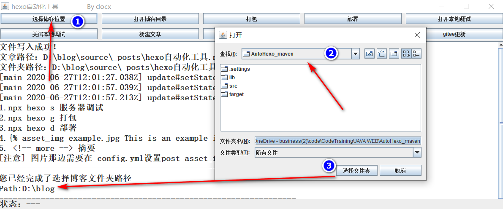

## hexo自动化工具

为了解决hexo每次写文章都需要输一堆命令，写文章的时候需要手动创建以及添加配置，以及gitee更新还需要登录账号这好多步骤的操作，于是想要把所有的操作集中到一个GUI的工具执行

<!-- more -->

### 环境准备

1. 首先需要安装node.js，Git，并且将node.js Git都已经配置到环境变量（安装包的时候默认添加）
2. 然后配置VisialCode到环境变量，因为要执行创建文章的时候顺带也打开了，打开的工具使用的是VisualCode
3. 在hexo博客所在目录位置`_config.yml`文件中的`deploy`项，设置好`repo`。
4. 在gitee设置好自己的私人令牌，拿到token填写到程序中。

### 软件操作

* 首先选择博客所安放的目录


* 接着开始调试、写文章、改博客代码等操作。

调试


写文章


* 做完所有修改博客的行为之后就是`打包-->部署-->更新` 一条龙服务！最后访问自己的域名便可。

> 打包就是把所有博客文件生成一堆静态文件，意义是gitee或者github不用再下载npm的一堆依赖了。  
> 部署就是把打包后的静态文件，部署到gitee pages或者github pages  
> 更新专门针对的是gitee，gitee需要手动更新gitee pages，这里需要用户自己的令牌token来完成更新api的操作。

### 代码解析

唯一让我调试了多次主要还是访问远程api

```java
HTTP http = HTTP.builder().build();
        HttpCall post = http.async("https://gitee.com/api/v5/repos/bigzcoder/bigzcoder/pages/builds")
                .setOnResponse((HttpResult result) -> {
                    System.out.println(result.toString());
                }).addHeader("Content-Type", "application/json")
                .addBodyParam("access_token", "****d9229103dd92ad95**").post();
```

新建文章主要是用了IO操作，把文章的文件以及文件夹写到`sources/_post`里边

```java
fileDir.mkdir();
Date date = new Date();
SimpleDateFormat formatter = new SimpleDateFormat("yyyy-MM-dd HH:mm:ss");
file.createNewFile();
fw = new FileWriter(file); // 创建文件输出流
bw = new BufferedWriter(fw); // 使用缓冲区数据流封装输出流
write(bw, "---");
write(bw, "title: " + PostConfigSetView.postTitle.getText());
write(bw, "date: " + formatter.format(date));
write(bw, "tags: " + PostConfigSetView.postTags.getText());
write(bw, "description: " + PostConfigSetView.postDescrption.getText());
write(bw, "categories: " + PostConfigSetView.postCategories.getText());
write(bw, "feature: " + PostConfigSetView.postFeature.getText());
write(bw, "toc: " + PostConfigSetView.postToc.isSelected());
write(bw, "---");
JOptionPane.showMessageDialog(MainFrame.mainWorkSpace, "文件写入成功！");
MainFrame.displayArea.append("文件写入成功！\n");
MainFrame.displayArea.append("文章路径：" + file + "\n");
MainFrame.displayArea.append("文件夹路径：" + fileDir + "\n");
```

部署更新都是直接用的api调用npx hexo的命令，非常简单，不多说了。

### 总结

自己写完图形的话，最大的好处就是集成操作，一个程序，做了所有事情，东西其实挺折磨人的。  
源码已经上传到github上，用了自取哈。